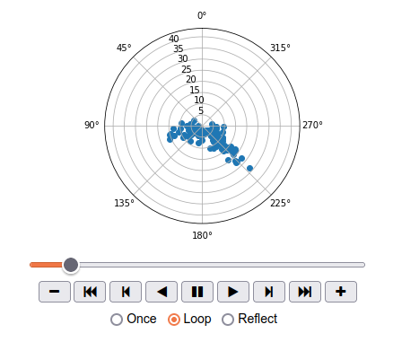
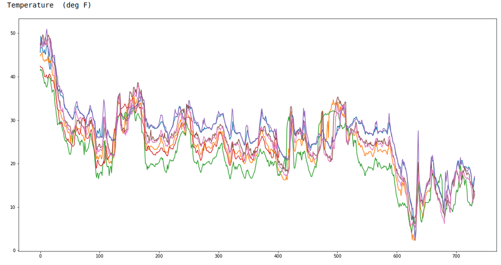

# Weather Data
When traveling in the backcountry during winter time, updating yourself on current and recent weather data is important to understand likely avalanche danger.

This is a repository of Jupyter Notebooks to analyze recent weather data using the [NWAC Data Portal](https://nwac.us/data-portal/).

## Setup

#### Install Requirements

`$ pip install -r requirements.txt`

#### Start Notebook

`$ jupyter notebook WeatherData.ipynb`

## Visualizations
There are two kinds of visualizations

#### Radial Plots
This will plot vectors of `X=degree` and `Y=magnitude`. These plots can be animated to show the recent trends over time.

This notebook will plot wind direction and magnitude so you can visualize what aspects might have windloaded snow.

#### Multiple Station Attributes
These graphs will graph multiple weather stations on a single graph using a common attribute, like `Temperature`.

